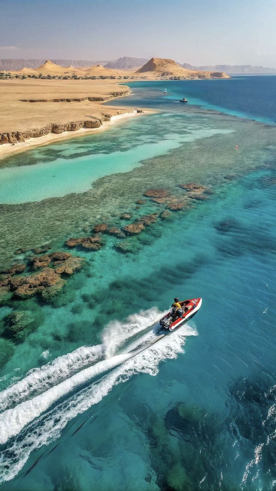

# Sharm Cloud Tours

### *Discover. Book. Explore Sharm El-Sheikh.*

 

**[Live Demo](https://sharmcloudtours.vercel.app/)**

---

## Overview

Sharm Cloud Tours is a **single-vendor tour booking platform** built for tourism agencies in Sharm El-Sheikh, Egypt. It targets international tourists (English & Russian) and provides a full-featured admin dashboard for managing tours, bookings, reviews, and customer communication.

> Built with **Next.js 16**, **Prisma**, **PostgreSQL**, and **Tailwind CSS** — deployed with **Docker** and **Nginx** for under **$11/month**.

*Discover breathtaking underwater worlds and desert adventures in Sharm El-Sheikh*

---

## Features

<table>
<tr>
<td width="50%">

#### Tourist Experience
- **Tour Discovery** — Browse, search, and filter tours with a rich grid view
- **Multi-Language** — English & Russian with locale-prefixed URLs (`/en/`, `/ru/`)
- **Multi-Currency** — USD, EGP, RUB with live exchange rates
- **Booking System** — Date/guest selection with capacity checking & email confirmation
- **Reviews & Ratings** — Star ratings, comments, and admin replies
- **Wishlist** — Save favorite tours for later
- **Dark Mode** — True noir theme with one-click toggle
- **Real-time Messaging** — Chat directly with the agency
- **Responsive** — Mobile-first design that looks stunning everywhere

</td>
<td width="50%">

#### Admin Dashboard
- **Analytics Overview** — Pending bookings, confirmed tours, review stats
- **Tour Management** — Full CRUD with translations, image upload, itinerary editor
- **Booking Management** — Confirm, cancel, complete — or create bookings for users
- **Review Moderation** — Approve/reject with admin replies
- **User Management** — View users with online status indicators
- **Message Center** — Real-time chat with broadcast capability
- **Contact Settings** — Edit phone, WhatsApp, address with live preview
- **Image Management** — Preview and organize uploaded images

</td>
</tr>
</table>

---

## Tech Stack

| Layer | Technology |
|:---:|:---|
| **Framework** | `Next.js 16` (App Router) + `React 19` |
| **Language** | `TypeScript 5` (strict mode) |
| **Styling** | `Tailwind CSS 4` + CSS custom properties |
| **Database** | `PostgreSQL 18` via Docker |
| **ORM** | `Prisma 5.22` |
| **Auth** | `NextAuth.js` (Google OAuth + Email/Password) |
| **Payments** | `Stripe` (feature-flagged) |
| **Email** | `Nodemailer` (Gmail SMTP) |
| **Validation** | `Zod 4` |
| **i18n** | `next-intl 4` |
| **Images** | `Cloudinary` |
| **Theme** | `next-themes` |
| **Container** | `Docker` + `Docker Compose` |
| **Reverse Proxy** | `Nginx` (SSL + gzip + caching) |
| **Package Manager** | `pnpm 11` |

---

## Pages

| Page | Description |
|------|-------------|
| **Home** | Hero section with featured tours and customer reviews |
| **Tours** | Browse all tours with search, filters, and sorting |
| **Tour Detail** | Images, itinerary, highlights, pricing, and booking widget |
| **Booking** | Date/guest selection with confirmation and email notification |
| **Profile** | Personal info, booking history, and review management |
| **Wishlist** | Saved tours for later |
| **Messages** | Chat directly with the agency |
| **About** | Learn about Sharm Cloud Tours |
| **Contact** | Get in touch with the team |
| **FAQ** | Frequently asked questions |
| **Auth** | Sign in, sign up, email verification, password reset |

---

## Security

- **CSP / HSTS** security headers
- **Rate limiting** on auth endpoints
- **Input validation** with Zod on all forms
- **RBAC** — Admin dashboard protected by role-based access control

---

**Built with care for tourism agencies in Sharm El-Sheikh, Egypt**

